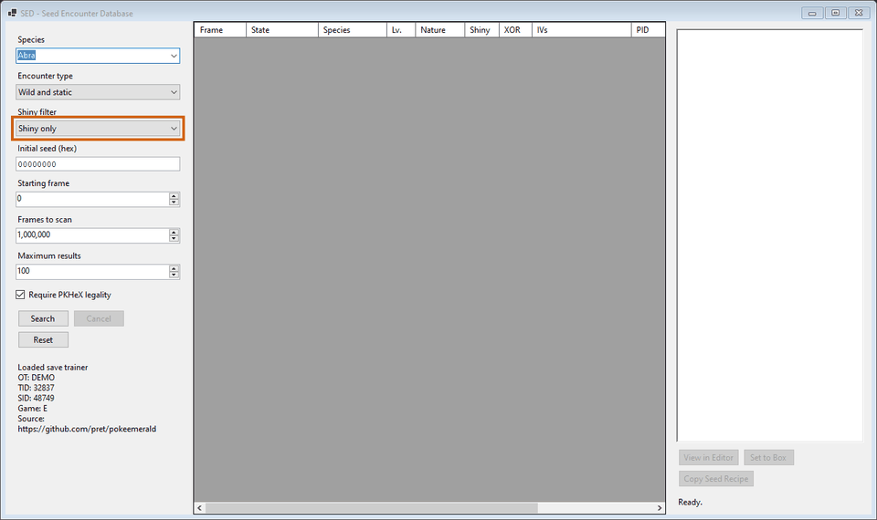

# sed

PKHeX plugin that reconstructs deterministic Generation III encounters from an initial RNG seed and an exact searchable frame range.

The interface lives under **Tools → Data → SED - Seed Encounter Database** and provides focused filters for species encounter category legality and shininess.

SED calculates the Generation III trainer shiny value itself then requires that result to agree with PKHeX before any candidate satisfies the selected filter.

Generated Pokémon inherit the loaded save trainer name TID SID language and gender because every encounter conversion begins with the active PKHeX save context.

## Supported games

| Games | Source |
| --- | --- |
| Pokémon Ruby and Sapphire | [pret/pokeruby](https://github.com/pret/pokeruby) |
| Pokémon Emerald | [pret/pokeemerald](https://github.com/pret/pokeemerald) |
| Pokémon FireRed and LeafGreen | [pret/pokefirered](https://github.com/pret/pokefirered) |

## Installation

Download the [latest release](https://github.com/yardrack/sed/releases/latest) then place `sed.dll` inside the `plugins` directory beside `PKHeX.exe` before starting PKHeX again from Windows.

Load a supported save then open the SED menu and choose a species seed frame range encounter category and shiny policy before searching.
